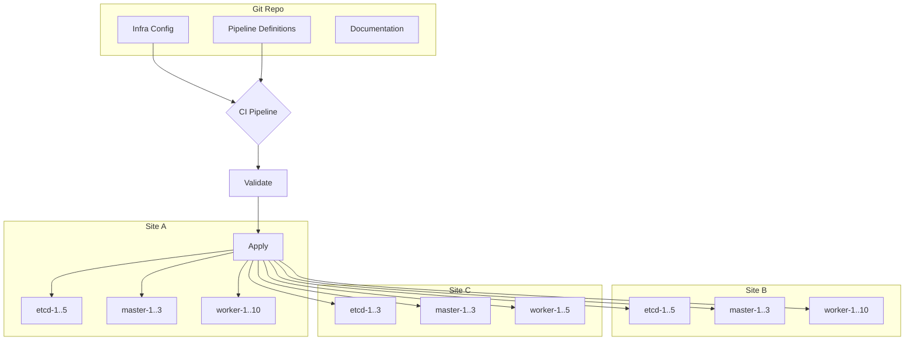
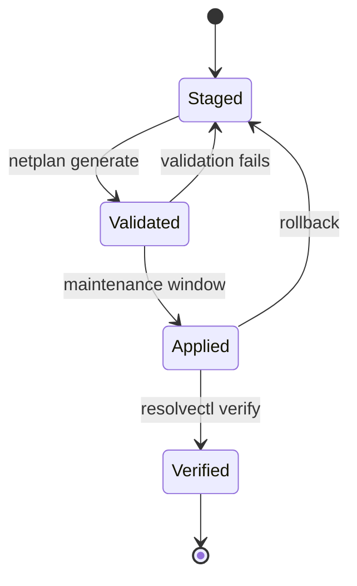

+++
title = 'Operating In A GitOps Environment: Practices That Hold Up'
date = 2026-06-10T00:00:00-05:00
draft = false
description = 'Opinionated practices for infrastructure teams working in a GitOps model: commit messages, semver for infrastructure, CI-triggered CD tradeoffs, and deployment automation patterns that survive production use.'
tags = ['gitops', 'cicd', 'devops', 'sre', 'automation']
categories = ['notes']
+++

GitOps adoption usually starts with the tooling and the pipeline mechanics. The harder part is the operating discipline: how a team of humans uses Git to communicate intent, manage risk, and recover from mistakes without bypassing the process.

This post covers the practices that matter most once the pipeline is running.

## Commit Messages Are Deployment Descriptions

In a GitOps model, the commit message is the primary documentation for every change. It is what operators read during incident review, what the rollback decision is based on, and what appears in the deployment log.

A useful commit message for an infrastructure change:

```text
platform/phx: bump K8s node template to ubuntu-2204-v2026.06.01

TICKET-4172

This image includes the kernel fix for CVE-2026-1234 and updates
containerd to v2.0.4. The previous template (ubuntu-2204-v2026.04.15)
is retained in vSphere and can be reinstated by reverting this commit.

Pre-apply validation: netplan generate passed on site-a-etcd-1.
Post-apply verification: kubelet version, node ready, and pod CIDR
all confirmed on the canary node before fleet rollout.
```

The format is:

- A subject line that identifies the target and the change.
- A ticket reference.
- A body that explains why, what the rollback path is, and what verification was done.

Commit messages that say "fix bug" or "update config" are not useful in a GitOps model because the commit is the deployment instruction. Every operator should be able to read `git log` and understand what was deployed and why.

### Tagging For Deployment

Not every commit should trigger a deployment. Branch-based triggers (every push to main) work for application code with fast feedback loops. Infrastructure changes benefit from explicit tagging:

```text
git tag deploy/platform/prod/v2026.06.10-01
```

The tag is the deployment request. The pipeline picks up the tag, validates the tree, and applies. This separates "merged" from "deployed" and gives operators control over timing.

Semver for infrastructure is useful when the artifact has a meaningful version boundary:

```text
vmware-template/v2026.06.01  # date-based, not semantic
terraform-module/storage/v1.4.2  # semantic, module consumers need compatibility
pipeline-config/v2  # major version indicates breaking change in pipeline behavior
```

Date-based versioning works better for infrastructure artifacts that do not have consumer compatibility contracts. Semantic versioning works for shared modules and APIs where consumers need to know the impact of an upgrade.

## CI Triggers CD: The Tradeoffs

The most natural GitOps pattern is CI discovers a change and triggers CD. This works well when:

- The change is small and scoped (single module version bump, one config key change).
- The target environment has good test coverage and fast feedback.
- The team is small and changes are infrequent.

It creates problems when:

- A documentation PR or comment-only change triggers a full deployment pipeline.
- Multiple commits land within minutes and the pipeline cannot keep up.
- An urgent hotfix must skip validation but the trigger does not support it.
- The CI system is down and no changes can be deployed even if they are safe.

These are not theoretical problems. Every team I have seen hit production scale with an automatic CI-to-CD trigger has added an approval gate or a manual release step within a year.

### Practical Middle Ground

Separate the CI trigger from the CD decision:

| Action | CI | CD |
|---|---|---|
| Trigger | Every push to any branch | Explicit tag or manual release |
| Validation | Lint, validate, plan | Same, plus approval gate |
| Apply | Never | Only from CD trigger |
| Rollback | No | Git revert + CD trigger |

The CI pipeline runs on every push and publishes artifacts (plans, validation results, image hashes). The CD pipeline only runs when an operator creates a tag or clicks approve. This gives CI the speed of automation and CD the control of human judgment.

## Webhook Implementations

Webhooks are the most common trigger mechanism for GitOps pipelines. The implementation choice matters for reliability.

### Polling Vs. Push

Polling (checking Git on a cron schedule) is simpler to debug but introduces delay and wastes pipeline worker cycles. Push (webhook from the Git provider to the pipeline) is responsive but adds a failure point.

For infrastructure, a hybrid approach works:

- Webhook triggers the pipeline for normal operations (fast feedback).
- A periodic polling job catches missed webhooks and reconciles state (safety net).

### Webhook Reliability Patterns

A webhook that fires but does not reach the pipeline is an undelivered deployment request. To handle this:

1. **Make webhooks idempotent.** The pipeline should check whether the commit or tag has already been processed. If it has, skip.
2. **Log every webhook payload.** Store the raw payload in a durable location so missed webhooks can be replayed.
3. **Monitor webhook delivery.** If the Git provider reports failed deliveries, the platform team should get an alert.
4. **Use a webhook proxy or relay.** A lightweight service that accepts webhooks, stores them, and forwards to the pipeline removes the pipeline's uptime from the webhook delivery path.

### Avoiding The Webhook Stampede

A force push that updates 20 commits in one event should not create 20 pipeline runs. The webhook handler should:

1. Buffer events for a short window (5-30 seconds).
2. Collapse multiple events on the same ref into a single trigger.
3. Trigger the pipeline once with the latest commit.

Without this, a rebase or force push can overwhelm the pipeline workers with redundant runs.

## Operating Cadence

A GitOps team's operating cadence should reflect the fact that Git is the control plane:

| Activity | Cadence | Tool |
|---|---|---|
| Merge minor changes | Daily as ready | PR + CI validation |
| Deploy to non-production | After merge | Tag or approval |
| Deploy to production | Scheduled or on demand | Tag + CD |
| Audit deployed state | Weekly | Pipeline verification job |
| Rehearse rollback | Monthly | Pipeline rollback job |
| Review Git log as deployment history | Per incident | `git log --oneline` |

The key principle: if it is not in Git, it is not deployed. If it is not in Git, it cannot be audited. If it is not in Git, it cannot be rolled back.

## What Breaks First

New GitOps teams hit these failure modes early:

- **The merge-to-deploy pipeline.** Every merge triggers a deployment, including documentation-only changes and WIP branches. Solution: tag-based or approval-gated CD.
- **The credential sprawl.** Pipeline credentials are shared across environments because it is easier to set up. Then a dev pipeline compromise becomes a prod incident. Solution: per-environment credentials scoped in the pipeline config.
- **The ad-hoc exception.** An urgent change is made via SSH because "the pipeline would take too long." The change is not documented, not in Git, and not rolled back when the pipeline runs the next normal deployment. Solution: create a hotfix branch and expedited review path, still through the pipeline.
- **The blind apply.** The pipeline applies without verification. A failed apply is not detected until the next alert. Solution: verification jobs after every apply that check the declared state against the target.

## Documentation As Code

A GitOps repo is not just configuration. It is the authoritative source for how the infrastructure works. If the documentation lives outside the repo (wiki, shared drive, chat history), it will drift from the configuration and operators will stop trusting it.

### Mermaid Diagrams In Repo

Mermaid lets you write diagrams as markdown code blocks. This is valuable in a GitOps repo because the diagram lives alongside the config it describes and changes in the same pull request.

A pipeline flow diagram in a repo README:

```mermaid
graph LR
    PR[Pull Request] --> CI[CI: Lint + Validate + Plan]
    CI --> Review[Plan Review]
    Review --> Tag[Create Deployment Tag]
    Tag --> CD[CD: Apply Non-Prod]
    CD --> Approve[Approve Prod]
    Approve --> Prod[CD: Apply Prod]
    Prod --> Verify[Verify State]
    Verify --> Done[Done]
    style Tag fill:#e6ccff,stroke:#333
    style Approve fill:#ffe6cc,stroke:#333
```



An architecture diagram for a multi-site cluster fleet:



A state machine for a deployment strategy:



These render automatically on GitHub, GitLab, and any markdown renderer that supports Mermaid. No screenshot tool, no image upload, no out-of-date asset.

### Keeping Diagrams Honest

The risk with any documentation is that it drifts from reality. Mermaid reduces the friction to update (edit the text, rerender) but does not eliminate drift. Two patterns help:

**Inline in README.** For simple flows that change infrequently, write the Mermaid block directly in the markdown file. It is reviewed with every PR that touches the related config.

**Generated from source.** For diagrams that should always match the infrastructure, generate them in CI. A pipeline job can parse Terraform state, Ansible inventory, or a cluster registry and produce a Mermaid diagram:

```bash
# Example: generate a cluster topology diagram from inventory
ansible-inventory -i inventory/prod.yaml --list \
  | jq -r '
    ._meta.hostvars | to_entries[]
    | select(.value.group_names[] | contains("rke2"))
    | "\(.key)[\(.value.group_names | join(","))]"
  ' \
  | mermaid-cli-input-generator > topology.mmd
```

The generated diagram is published as a pipeline artifact and linked from the README. If the inventory changes, the diagram changes in the next pipeline run. No manual update step.

Tools like `mermaid-cli` (`mmdc`) can render `.mmd` files to SVG or PNG in CI, which is useful for platforms that do not support native Mermaid rendering:

```bash
npx @mermaid-js/mermaid-cli mmdc -i topology.mmd -o topology.svg -w 1200
```

### Breaking READMEs Into Meaningful Places

A single monolithic README works for a small repo with one audience. Most infrastructure repos have multiple audiences with different questions:

| Audience | Wants To Know | Where To Put It |
|---|---|---|
| New team member | What does this repo own? How do I set up locally? | Top-level `README.md` |
| Operator | How do I deploy? How do I rollback? | `docs/deploy.md`, `docs/rollback.md` |
| Reviewer | What does the pipeline do? What are the gates? | `docs/pipeline.md` |
| Auditor | What changed, when, and who approved? | Link to pipeline runs + `CHANGELOG.md` |
| Consumer | What version of the module is current? What is the API? | `docs/consumer.md` or module-level `README.md` |

A structure that holds up:

```text
infra-repo/
├── README.md                 # repo overview, local setup, links to docs/
├── docs/
│   ├── architecture.md       # Mermaid diagrams for system architecture
│   ├── pipeline.md           # pipeline stages, gates, rollback procedure
│   ├── deploy.md             # deployment walkthrough for operators
│   └── tenant-onboarding.md  # how to add a new cluster or environment
├── CONTRIBUTING.md           # PR workflow, commit message format, review expectations
└── CHANGELOG.md              # version history, notable changes, breaking changes
```

The top-level README should be short enough to read in one minute. Everything else goes in `docs/`. This is the same principle as small functions in code: single responsibility makes each file reviewable and maintainable.

### Pipeline-Friendly Documentation

Documentation in a GitOps repo should be CI-friendly. This means:

- **Markdown, not PDF or Word.** Markdown is reviewable in a PR diff. PDFs and Word docs are binary blobs that hide changes.
- **Mermaid blocks, not screenshots.** Screenshots cannot be diffed. A Mermaid block change shows up clearly in a PR diff as added and removed lines.
- **Generated content has a CI step.** If a diagram or table is generated from infrastructure data, the generation script runs in CI and fails if the output does not match what is committed. This is the same pattern as `terraform validate` or `go generate`.
- **Links are relative.** Absolute links to external wikis rot. Relative links within the repo are validated by the pipeline and break visibly if a file is moved.

## Summary Of Practices

| Practice | Why It Matters |
|---|---|
| Commit messages describe the deployment | The commit log is the deployment history |
| Tags trigger CD, not branches | Separates merged from deployed |
| CI runs on every push, CD only on request | Speed with control |
| Webhooks are idempotent and monitored | Reliable delivery without duplicates |
| Per-environment credentials | Limits blast radius of credential leaks |
| Verification after apply | Detects failed or partial applies |
| Rollback is a practiced procedure | Not all changes revert cleanly |

GitOps is not just about putting YAML in a repo and syncing it. The operating model around the tooling is what determines whether the team trusts the pipeline or works around it.
